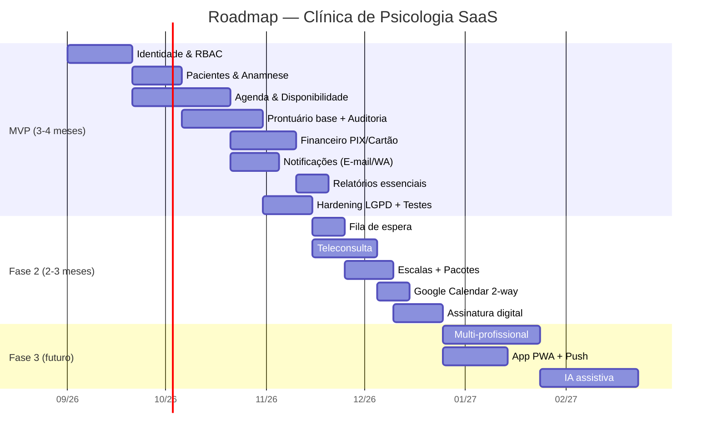
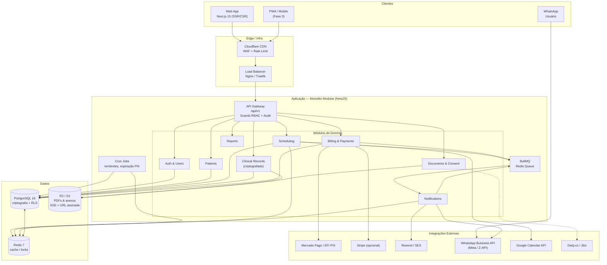
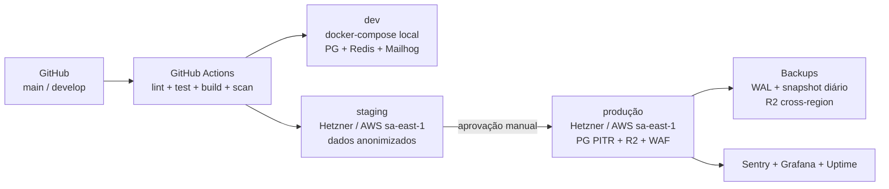
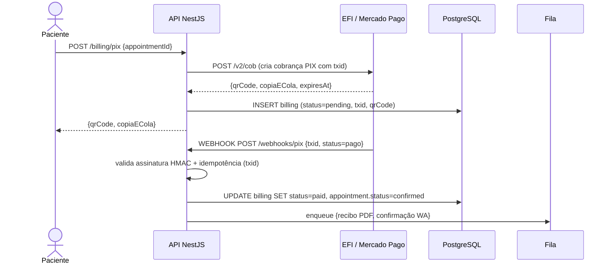
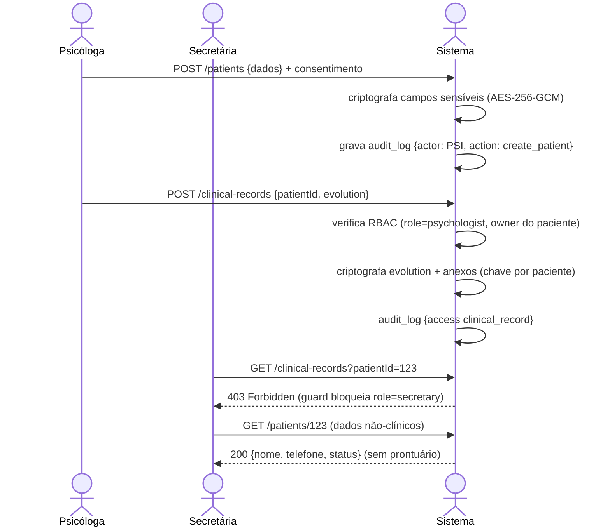
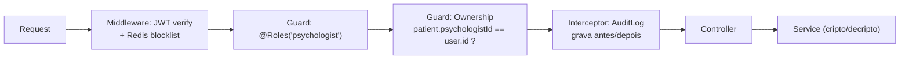
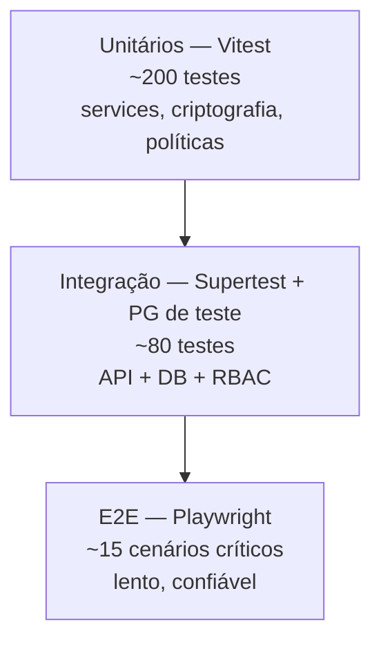

# Sistema de Gestão para Clínica de Psicologia — Documento de Escopo e Arquitetura

> **Versão:** 1.0 — 27/08/2026  
> **Autor:** Arquitetura Sênior (planejamento)  
> **Status:** Planejamento (sem código) — base para desenvolvimento  
> **Stack proposto:** Next.js 15 + NestJS + PostgreSQL + Redis + Prisma

---

## Índice

1. [Visão Geral do Produto](#1-visão-geral-do-produto)
2. [Escopo Funcional Completo](#2-escopo-funcional-completo)
3. [Arquitetura do Sistema](#3-arquitetura-do-sistema)
4. [Modelagem de Dados](#4-modelagem-de-dados)
5. [Definição de API](#5-definição-de-api)
6. [Autenticação e Controle de Acesso (RBAC)](#6-autenticação-e-controle-de-acesso-rbac)
7. [Segurança e Privacidade (LGPD)](#7-segurança-e-privacidade-lgpd)
8. [Integrações Externas Sugeridas](#8-integrações-externas-sugeridas)
9. [Estrutura de Pastas / Projeto](#9-estrutura-de-pastas--projeto)
10. [Infraestrutura e Deploy](#10-infraestrutura-e-deploy)
11. [Estratégia de Testes](#11-estratégia-de-testes)
12. [Riscos Técnicos e Pontos de Atenção](#12-riscos-técnicos-e-pontos-de-atenção)
13. [Estimativa de Complexidade / Esforço](#13-estimativa-de-complexidade--esforço)
14. [Checklist Resumido do MVP](#14-checklist-resumido-do-mvp)
15. [Decisões Arquiteturais Registradas (ADRs)](#15-decisões-arquiteturais-registradas-adrs)

---

## 1. Visão Geral do Produto

### 1.1 Objetivo
Construir um SaaS de gestão para clínicas/consultórios de psicologia que centralize **agenda, prontuário psicológico eletrônico, financeiro, comunicação e teleconsulta** em um único lugar, com foco em **conformidade LGPD**, experiência do paciente e eficiência operacional da psicóloga/secretaria. O sistema elimina planilhas, WhatsApp desorganizado, cadernos de prontuário e gateways de pagamento desconectados.

### 1.2 Público-alvo

| Persona | Dor principal | O que valoriza |
|---|---|---|
| **Paciente** (B2C) | Dificuldade para agendar, pagar, lembrar consulta, acessar recibos | Autoagendamento 24h, PIX/cartão, lembretes, histórico, privacidade |
| **Psicóloga autônoma / Sócia da clínica** (B2B principal) | Agenda caótica, prontuário em papel, inadimplência, falta de métricas | Agenda inteligente, prontuário seguro e buscável, financeiro, relatórios CFP-compliant |
| **Secretária/Recepção** (operacional) | Retrabalho, acesso indevido a dados sensíveis, confirmações manuais | Gestão de agenda/fila sem ver prontuário, check-in, cobranças |
| **Clínica com múltiplas psicólogas** (expansão) | Rateio, salas, repasse, isolamento de prontuários entre profissionais | Multi-tenant por profissional, salas, permissões finas |

### 1.3 Proposta de Valor / Diferenciais

1.  **LGPD nativo para saúde mental:** criptografia de prontuário por paciente, controle de acesso por papel com trilha de auditoria, consentimento granular (termo, uso de dados, teleconsulta, gravação). Poucos concorrentes tratam isso com seriedade.
2.  **PIX + recorrência + política de cancelamento automatizada:** cobrança automática, taxa de no-show parametrizável, baixa manual e conciliação.
3.  **Fluxo clínico, não só agenda:** anamnese digital, evolução por sessão (SOAP adaptado para psi), upload de documentos, genograma, escalas (PHQ-9, GAD-7, etc.).
4.  **Operação híbrida presencial + teleconsulta:** link único Jitsi/Daily, sala de espera virtual, registro de presença.
5.  **WhatsApp como canal primário (Brasil):** confirmação, lembrete, envio de recibo e link de pagamento via template aprovado, com opt-in LGPD.

### 1.4 Princípios de Produto

*   Privacidade por padrão (Privacy by Design).
*   Mobile-first para paciente; desktop-first para psicóloga.
*   Automação onde há atrito (lembretes, cobrança, reagendamento).
*   Auditoria de tudo que toca prontuário.

---

## 2. Escopo Funcional Completo

### 2.1 Mapa de Módulos

```
[M1] Identidade & Acesso
[M2] Pacientes & Responsáveis
[M3] Agenda & Disponibilidade
[M4] Prontuário Eletrônico (PEP)
[M5] Financeiro & Pagamentos
[M6] Comunicação & Notificações
[M7] Teleconsulta
[M8] Documentos & Assinaturas
[M9] Relatórios & Métricas
[M10] Conteúdo / Site Institucional (opcional)
[M11] Administração SaaS (multi-clínica, planos, billing do sistema)
```

### 2.2 Funcionalidades por Perfil

#### Paciente (Portal do Paciente)

| ID | Funcionalidade | MVP | Fase 2 | Fase 3 |
|---|---|---|---|---|
| P1 | Cadastro + validação e-mail/telefone + aceite LGPD/Termos | ✅ | | |
| P2 | Agendamento online com base na disponibilidade real da psicóloga | ✅ | | |
| P3 | Reagendamento/cancelamento com política (ex: 24h sem taxa) | ✅ | | |
| P4 | Fila de espera / notificação quando abre vaga | | ✅ | |
| P5 | Visualização de histórico de sessões (data, status, sem conteúdo clínico) | ✅ | | |
| P6 | Formulários pré-consulta: anamnese, escalas, consentimento informado | ✅ (anamnese + consentimento) | ✅ (escalas) | |
| P7 | Pagamentos: PIX, cartão, boleto; comprovantes e 2ª via | ✅ (PIX + cartão) | ✅ (boleto/recorrência) | |
| P8 | Recibos/notas para reembolso convênio/declaração IR | ✅ | | |
| P9 | Lembretes automáticos e confirmação com 1 clique (WhatsApp/e-mail) | ✅ | | |
| P10 | Área de documentos (contrato, recibos, atestados sob liberação) | ✅ | | |
| P11 | Chat assíncrono com a clínica (não substitui terapia) | | ✅ | |
| P12 | Videochamada/teleconsulta no navegador | | ✅ | |
| P13 | Avaliação pós-sessão (NPS / como se sentiu) | | ✅ | |
| P14 | Integração com Google Calendar (adicionar à agenda) | | ✅ | |
| P15 | Dependentes / responsável financeiro (crianças/adolescentes) | | ✅ | |
| P16 | App PWA / notificações push | | | ✅ |

#### Psicóloga / Administradora (Painel Clínico)

| ID | Funcionalidade | MVP | Fase 2 | Fase 3 |
|---|---|---|---|---|
| PSI1 | Dashboard: agenda do dia/semana, alertas (inadimplentes, fila, anamneses pendentes) | ✅ | | |
| PSI2 | Gestão de disponibilidade: horários, bloqueios, férias, salas | ✅ | | |
| PSI3 | Gestão de pacientes: CRUD, busca, tags, status (ativo/inativo/alta) | ✅ | | |
| PSI4 | Prontuário: evolução por sessão (SOAP/Psi), histórico, anexos | ✅ | | |
| PSI5 | Anotações privadas (psicóloga não compartilha com paciente/secretaria) | ✅ | | |
| PSI6 | Modelos de evolução e de documentos (atestado, declaração, recibo) | ✅ (básico) | ✅ (editor) | |
| PSI7 | Financeiro: lançamentos, status (pago/pendente/atrasado), baixa manual, estorno | ✅ | | |
| PSI8 | Política de cancelamento/no-show e cobrança automática de taxa | ✅ | | |
| PSI9 | Relatórios: faturamento, taxa ocupação, ticket médio, inadimplência, origem | ✅ (essenciais) | ✅ (avançados) | |
| PSI10 | Envio de lembretes/notificações em lote | ✅ | | |
| PSI11 | Auditoria: quem acessou/alterou prontuário, quando | ✅ | | |
| PSI12 | Importação de pacientes (CSV) | | ✅ | |
| PSI13 | Escalas psicométricas com pontuação automática (PHQ-9, GAD-7, etc.) | | ✅ | |
| PSI14 | Supervisão/compartilhamento de caso (com consentimento) | | | ✅ |
| PSI15 | Multi-profissional: isolamento de prontuários, rateio, repasse | | | ✅ |
| PSI16 | Assinatura digital de documentos (ICP-Brasil / click-to-sign) | | ✅ | |

#### Recepção / Secretaria (perfil intermediário)

| ID | Funcionalidade | MVP | Fase 2 | Fase 3 |
|---|---|---|---|---|
| SEC1 | Agenda completa: criar/editar/cancelar agendamentos | ✅ | | |
| SEC2 | Check-in / confirmação de presença | ✅ | | |
| SEC3 | Cadastro e atualização de dados não-clínicos do paciente | ✅ | | |
| SEC4 | Financeiro operacional: gerar cobrança, dar baixa, enviar recibo | ✅ | | |
| SEC5 | Fila de espera e encaixes | | ✅ | |
| SEC6 | Sem acesso a prontuário/evolução/anexos clínicos (hard block no backend) | ✅ | | |
| SEC7 | Relatórios operacionais (ocupação, faltas) sem dados clínicos | ✅ | | |

#### Sistema / Admin SaaS (dono do software)

*   Cadastro de clínicas/tenants, planos e limites (nº psicólogas, pacientes, storage).
*   Billing do SaaS (assinatura da clínica).
*   Logs globais, impersonate com trilha, feature flags por tenant.

### 2.3 Funcionalidades Transversais Recomendadas

**Incluir no MVP (recomendado, mas frequentemente esquecido):**
*   Política de cancelamento configurável (ex: até 24h grátis, depois 50%, no-show 100%).
*   Bloqueio de agenda por horário/sala/feriado.
*   Anamnese digital com campos obrigatórios + consentimento informado assinado.
*   Geração automática de recibo em PDF com dados da psicóloga (CRP) para reembolso.
*   Logs de auditoria imutáveis para prontuário.
*   Exportação de dados do paciente (direito LGPD) em 1 clique.

**Fase 2 (diferenciação):**
*   Fila de espera inteligente (avisa 3 primeiros por WhatsApp, primeiro que confirma pega a vaga).
*   Pacotes/sessões pré-pagas (ex: 8 sessões) com controle de saldo.
*   Lembrete com botão “Confirmar / Reagendar / Cancelar” via WhatsApp Action Buttons.
*   Integração Google Calendar 2-way (bloqueia disponibilidade).
*   Avaliação pós-sessão + NPS mensal.
*   Área de conteúdo/blog para SEO local.

**Fase 3 / Futuro (vallley of nice-to-have):**
*   Aplicativo móvel nativo (ou PWA instalável).
*   IA assistiva: sugestão de evolução a partir de rascunho (sem substituir juízo clínico), detecção de risco e alerta — sempre com revisão humana e aviso explícito.
*   Convênios: guia TISS (se expandir para planos).
*   Marketplace de horários (paciente busca “psicóloga com vaga amanhã 18h”).
*   Programa de indicação e cupons.

### 2.4 Roadmap por Fases



---

## 3. Arquitetura do Sistema

### 3.1 Escolha e Justificativa do Stack

| Camada | Tecnologia escolhida | Alternativas avaliadas | Por que esta escolha (saúde/LGPD/Brasil) |
|---|---|---|---|
| **Frontend Web** | **Next.js 15 (App Router) + TypeScript + Tailwind CSS + shadcn/ui** | Remix, Nuxt, CRA | SSR/SSG para SEO (blog institucional), ótimo DX, App Router com Server Components reduz JS no cliente, ecossistema maduro para LGPD (cookies seguros, middleware). Tailwind + shadcn garante UI acessível e rápida sem lock-in. |
| **Backend** | **NestJS 11 + TypeScript (Node 22 LTS)** | Spring Boot (Java), Django (Python), Laravel (PHP) | Modular monolith natural (módulos por domínio), decorators para RBAC/guards, validação com `class-validator`, fila e cron nativos. Time-to-market menor que Java, tipagem forte (crítica para prontuário). Interop total com libs JS de criptografia. |
| **ORM** | **Prisma 6** | TypeORM, Drizzle, Sequelize | Tipagem end-to-end, migrations seguras, middleware para criptografia de campo, ótimo suporte a PostgreSQL RLS. |
| **Banco principal** | **PostgreSQL 16** | MySQL, MongoDB | ACID, JSONB (para anamnese dinâmica sem perder relacional), `pgcrypto`, Row-Level Security opcional, PITR, extensão `pg_cron`. Evitar Mongo aqui: prontuário exige integridade referencial e auditoria forte. |
| **Cache / Sessão / Rate limit** | **Redis 7 (Upstash ou self-host)** | Memcached | Cache de disponibilidade (leitura intensa), sessions, rate-limit login, lock distribuído para concorrência de agendamento. |
| **Fila / Jobs** | **BullMQ (Redis) + NestJS Schedule** | RabbitMQ, SQS | E-mail/WhatsApp, geração de PDF, lembretes, expiração de Pix. BullMQ tem retries, backoff, cron e dashboard (Bull Board). |
| **Storage de arquivos** | **S3-compatível (Cloudflare R2 ou AWS S3 sa-east-1)** | Local FS | Recibos PDF, anexos de prontuário, termos assinados. Criptografia SSE-S3 + URLs assinadas com expiração. R2 sem egress fee é vantajoso no Brasil. |
| **Auth** | **JWT (access 15min + refresh httpOnly 7d) + Argon2id** | NextAuth, Clerk, Auth0 | Controle total sobre sessão, sem dependência externa para dados sensíveis. Refresh rotation + reuse detection. |
| **Validação / Docs API** | **Zod + Swagger (OpenAPI 3.1)** | Joi, class-validator only | Zod compartilhado front/back, OpenAPI gera contrato e testes. |
| **Observabilidade** | **OpenTelemetry → Grafana Cloud / Sentry + Pino (log JSON)** | Datadog | Rastreio de acesso a prontuário, erros e performance de agendamento. |
| **Infra** | **Docker + GitHub Actions + VPS Hetzner / AWS ECS (sa-east-1)** | Vercel only | Vercel para frontend é ok, mas backend de saúde com dados sensíveis prefere região Brasil (LGPD art. 33 — transferência internacional). Hetzner + Coolify ou AWS São Paulo reduz latência e custo. |

> **Nota Brasil:** manter dados em `sa-east-1` (São Paulo) ou provedor com data center BR (HostDime, Locaweb) facilita argumentação LGPD e reduz latência para PIX/webhooks. Evitar US-only.

### 3.2 Arquitetura Geral — Decisão: **Monolito Modular (Modular Monolith)**

**Decisão:** começar como **monolito modular bem delimitado**, não microsserviços nem serverless puro.

**Justificativa:**

| Fator | Monolito Modular | Microsserviços | Serverless |
|---|---|---|---|
| Tamanho do time (1-5 devs) | ✅ deploy único, refatoração simples | ❌ overhead operacional | ⚠️ cold start em jobs críticos |
| Transações (agendar + cobrar + notificar) | ✅ transação ACID local | ❌ saga/distribuída | ❌ limites de timeout |
| LGPD/auditoria | ✅ trilha centralizada | ❌ dispersa | ⚠️ logs fragmentados |
| Evolução | Módulos com boundaries claros → extrai para serviço quando houver escala real (ex: serviço de notificações) | Prematuro | Pode extrair workers serverless depois |

**Regra de ouro:** cada módulo (`Patients`, `Scheduling`, `ClinicalRecords`, `Billing`, `Notifications`) só se comunica via **interface pública** (facade) e eventos de domínio (`AppointmentCreatedEvent`), nunca via acesso direto ao DB alheio. Isso permite quebrar em microsserviços sem reescrever.

**Quando quebrar:** quando um módulo tiver escala ou requisito isolado (ex: serviço de vídeo com autoscale, serviço de notificações com throughput alto).

### 3.3 Diagrama de Arquitetura de Alto Nível



### 3.4 Diagrama de Deploy (ambientes)



### 3.5 Fluxos Principais

#### Fluxo 1 — Agendamento (concorrência segura)

```mermaid
sequenceDiagram
    actor P as Paciente
    actor S as Sistema (NestJS)
    participant PG as PostgreSQL
    participant RD as Redis (lock)
    participant Q as BullMQ
    participant N as Notificações

    P->>S: GET /availability?psychologistId=1&date=2026-09-10
    S->>RD: GET cache disponibilidade
    RD-->>S: slots livres
    S-->>P: 200 {slots: ["09:00","10:00"]}

    P->>S: POST /appointments {slot: "10:00", serviceId: 2}
    S->>RD: SETNX lock:slot:1:2026-09-10T10:00 (TTL 10s)
    alt lock obtido
        S->>PG: BEGIN; SELECT ... FOR UPDATE (verifica conflito)
        PG-->>S: slot ainda livre
        S->>PG: INSERT appointment (status=pending_payment) + COMMIT
        S->>RD: DEL lock
        S->>Q: enqueue {confirmacao, lembrete24h, expiracao15min}
        S-->>P: 201 {appointmentId, pixQrCode}
        Q->>N: envia confirmação (e-mail + WA)
    else lock não obtido / conflito
        S-->>P: 409 Slot já reservado — ofereça fila de espera
    end
```

**Regras de negócio do fluxo:**
*   Lock distribuído (Redis `SET NX EX`) + `SELECT FOR UPDATE` evita double-booking sob concorrência.
*   `pending_payment` expira em 15min se PIX não pago (job BullMQ).
*   Política de cancelamento verifica `now < appointment.start - 24h` para definir taxa.

#### Fluxo 2 — Pagamento PIX



*   Webhook com **validação de assinatura + idempotência** (tabela `webhook_events` com `eventId` unique).
*   Conciliação diária via cron que lista `pending` expirados e reconcilia com API do PSP.

#### Fluxo 3 — Cadastro clínico e acesso a prontuário (LGPD)



---

## 4. Modelagem de Dados

### 4.1 Entidades Principais e Relacionamentos (resumo)

*   **User** 1—1 **PsychologistProfile** / **SecretaryProfile** / **PatientProfile** (herança via `role` + tabelas de perfil).
*   **Patient** N—N **Psychologist** via **PatientPsychologist** (suporta multi-psi no futuro; hoje 1 psicóloga dona).
*   **Patient** 1—N **Appointment**, **ClinicalRecord**, **Document**, **Consent**, **Billing**, **FormResponse**.
*   **Psychologist** 1—N **AvailabilityRule**, **TimeBlock**, **Appointment**, **ClinicalRecord** (autor).
*   **Appointment** 1—1 **Billing** (opcional), N—1 **Service** (tipo de sessão).
*   **AuditLog** polimórfico (quem acessou o quê, quando, de onde).

### 4.2 Diagrama ER (Mermaid)

```mermaid
erDiagram
    users ||--o{ patients : "é dono (role=patient)"
    users ||--o{ psychologists : "é dono (role=psychologist)"
    users ||--o{ secretaries : "é dono (role=secretary)"

    users {
        uuid id PK
        string email UK
        string passwordHash
        enum role "patient|psychologist|secretary|admin"
        boolean emailVerified
        datetime createdAt
        datetime deletedAt "soft delete LGPD"
    }

    psychologists {
        uuid id PK
        uuid userId FK
        string name
        string crp UK "CRP 06/XXXXX"
        string phone
        string pixKey
        jsonb settings "política cancelamento, etc"
    }

    patients {
        uuid id PK
        uuid userId FK "nullable se cadastro pela secretaria"
        uuid psychologistId FK "dona do prontuário"
        string name
        string cpf UK "criptografado + hash busca"
        date birthDate
        string phone "criptografado"
        string email "criptografado"
        enum status "active|inactive|discharged"
        jsonb anamnesis "JSONB flexível"
        datetime lgpdConsentAt
        datetime createdAt
    }

    patient_psychologists {
        uuid patientId FK
        uuid psychologistId FK
        enum relation "primary|shared"
        datetime createdAt
    }

    secretaries {
        uuid id PK
        uuid userId FK
        uuid psychologistId FK "a quem serve"
        string name
    }

    services {
        uuid id PK
        uuid psychologistId FK
        string name "Sessão 50min, Avaliação"
        int durationMinutes
        decimal price
        boolean active
    }

    availability_rules {
        uuid id PK
        uuid psychologistId FK
        int weekday "0-6"
        time startTime
        time endTime
        int slotDuration "ex: 50"
    }

    time_blocks {
        uuid id PK
        uuid psychologistId FK
        datetime startAt
        datetime endAt
        string reason "férias, congresso"
    }

    appointments {
        uuid id PK
        uuid patientId FK
        uuid psychologistId FK
        uuid serviceId FK
        datetime startAt
        datetime endAt
        enum status "pending_payment|confirmed|cancelled|no_show|completed"
        enum modality "presential|online"
        string room
        string cancelReason
        decimal cancelFee
        uuid billingId FK
        datetime createdAt
    }

    waitlist {
        uuid id PK
        uuid patientId FK
        uuid psychologistId FK
        date desiredDate
        string timePreference "manhã/tarde"
        enum status "waiting|notified|converted|expired"
        datetime createdAt
    }

    clinical_records {
        uuid id PK
        uuid patientId FK
        uuid psychologistId FK "autor"
        uuid appointmentId FK "nullable"
        enum type "evolution|anamnesis|assessment"
        text content_encrypted "AES-256-GCM"
        string contentHash "para auditoria sem revelar"
        jsonb metadata "escala, CID, etc"
        datetime createdAt
        datetime updatedAt
    }

    documents {
        uuid id PK
        uuid patientId FK
        string fileName
        string s3Key
        string mimeType
        int sizeBytes
        enum category "consent|receipt|certificate|attachment"
        boolean isClinical "se true, só psi vê"
        datetime createdAt
    }

    consents {
        uuid id PK
        uuid patientId FK
        enum type "lgpd|treatment|teleconsult|image"
        string version
        text textSnapshot
        string signatureS3Key "termo assinado"
        datetime signedAt
        string ip
    }

    form_templates {
        uuid id PK
        string name "Anamnese Adulto, PHQ-9"
        jsonb schema "JSON Schema do formulário"
        boolean active
    }

    form_responses {
        uuid id PK
        uuid patientId FK
        uuid templateId FK
        jsonb answers_encrypted
        int score "para escalas"
        datetime submittedAt
    }

    billings {
        uuid id PK
        uuid appointmentId FK
        uuid patientId FK
        decimal amount
        decimal discount
        enum method "pix|card|boleto|cash|transfer"
        enum status "pending|paid|overdue|cancelled|refunded"
        string pspTxId "id no PSP"
        string pixQrCode
        string pixCopyPaste
        datetime dueAt
        datetime paidAt
        datetime createdAt
    }

    notifications {
        uuid id PK
        uuid appointmentId FK
        uuid patientId FK
        enum channel "email|whatsapp|sms|push"
        enum template "confirmation|reminder24h|payment|receipt"
        enum status "queued|sent|delivered|failed"
        string providerMessageId
        datetime sentAt
        jsonb payload
    }

    audit_logs {
        uuid id PK
        uuid actorUserId FK
        string actorRole
        string action "view|create|update|delete|export"
        string entityType "clinical_record|patient|billing"
        uuid entityId
        string ip
        string userAgent
        jsonb beforeAfterHash
        datetime createdAt
    }

    webhook_events {
        string eventId PK "idempotência"
        string source "efi|mercado_pago|stripe"
        jsonb payload
        enum status "received|processed|failed"
        datetime createdAt
    }

    patients ||--o{ appointments : has
    psychologists ||--o{ appointments : has
    services ||--o{ appointments : defines
    appointments ||--o| billings : "1-1"
    patients ||--o{ clinical_records : has
    patients ||--o{ documents : has
    patients ||--o{ consents : has
    patients ||--o{ form_responses : has
    patients ||--o{ billings : has
    patients ||--o{ waitlist : has
    psychologists ||--o{ availability_rules : has
    psychologists ||--o{ time_blocks : has
```



### 4.3 Detalhes de Campos Sensíveis e Criptografia

| Campo | Estratégia |
|---|---|
| `patients.cpf`, `phone`, `email` | **Criptografia em nível de aplicação (AES-256-GCM)** com chave mestra no Vault/KMS; coluna adicional `cpf_hash` (HMAC-SHA256 com pepper) para busca exata sem decriptar. |
| `clinical_records.content_encrypted`, `form_responses.answers_encrypted` | AES-256-GCM com **chave por paciente** (DEK) envelopada pela chave mestra (KEK). Rotação de KEK sem re-criptografar tudo. |
| `documents` no S3 | SSE-S3 + **URL assinada** com expiração de 15min; nunca URL pública. |
| `audit_logs` | Append-only, sem UPDATE/DELETE (trigger ou RLS que bloqueia). Hash encadeado opcional para prova de integridade. |

**Índices críticos:**
*   `appointments(psychologistId, startAt)` + índice de exclusão para evitar sobreposição (ou `EXCLUDE USING gist`).
*   `patients(psychologistId, status)`.
*   `billings(status, dueAt)` para cron de inadimplência.
*   `audit_logs(entityType, entityId, createdAt)`.

---

## 5. Definição de API

**Padrão:** REST JSON sob `/api/v1` + OpenAPI 3.1 (Swagger em `/docs`). Versionamento por URL. Paginação com `?page&limit` + cursor para listas grandes. Respostas com `envelope` `{ data, meta, error }`.

**Autenticação:** `Authorization: Bearer <accessToken>` (JWT 15min). Refresh via `httpOnly Secure SameSite=Strict` cookie em `/auth/refresh`.

### 5.1 Endpoints por Domínio

#### Auth & Users

| Método | Rota | Auth | Papel | Propósito |
|---|---|---|---|---|
| POST | `/auth/register` | não | público | Cadastro paciente (e-mail+senha+LGPD) |
| POST | `/auth/login` | não | público | Login; retorna accessToken + set-cookie refresh |
| POST | `/auth/refresh` | cookie | qualquer | Rotação de refresh |
| POST | `/auth/logout` | sim | qualquer | Invalida refresh (blocklist Redis) |
| POST | `/auth/forgot-password` | não | público | Envia e-mail de reset (token 1h) |
| POST | `/auth/reset-password` | não | público | Define nova senha |
| GET | `/users/me` | sim | qualquer | Perfil logado |
| PATCH | `/users/me` | sim | qualquer | Atualiza perfil |
| POST | `/auth/invite-secretary` | sim | psychologist | Convida secretária (e-mail com token) |

#### Pacientes

| Método | Rota | Auth | Papel | Propósito |
|---|---|---|---|---|
| GET | `/patients` | sim | psychologist, secretary | Lista paginada (secretaria sem dados clínicos) |
| POST | `/patients` | sim | psychologist, secretary | Cria paciente (secretaria não envia anamnese clínica) |
| GET | `/patients/:id` | sim | psychologist, secretary (filtrado), patient (self) | Detalhe |
| PATCH | `/patients/:id` | sim | psychologist, secretary (só não-clínico) | Atualiza |
| DELETE | `/patients/:id` | sim | psychologist | Soft delete + inicia fluxo LGPD (anonimização) |
| GET | `/patients/:id/export` | sim | psychologist, patient (self) | Exporta todos os dados (JSON+PDF) — direito de portabilidade |
| POST | `/patients/:id/consents` | sim | patient, psychologist | Registra aceite de termo |

#### Agenda & Disponibilidade

| Método | Rota | Auth | Papel | Propósito |
|---|---|---|---|---|
| GET | `/availability` | sim | patient, secretary, psychologist | Slots livres: `?psychologistId&from&to&serviceId` |
| GET | `/availability/rules` | sim | psychologist | Lista regras de disponibilidade |
| PUT | `/availability/rules` | sim | psychologist | Substitui regras da semana |
| POST | `/time-blocks` | sim | psychologist, secretary | Bloqueia período (férias) |
| GET | `/appointments` | sim | todos | Lista (filtros: status, date, patientId) |
| POST | `/appointments` | sim | patient, secretary, psychologist | Cria agendamento (com lock) |
| PATCH | `/appointments/:id/cancel` | sim | todos | Cancela (aplica política de taxa) |
| PATCH | `/appointments/:id/reschedule` | sim | todos | Reagenda (valida política) |
| PATCH | `/appointments/:id/confirm` | sim | secretary, psychologist | Confirma manual |
| PATCH | `/appointments/:id/complete` | sim | psychologist | Marca como realizada |
| PATCH | `/appointments/:id/no-show` | sim | psychologist, secretary | Marca falta |
| GET | `/waitlist` | sim | psychologist, secretary | Fila de espera |
| POST | `/waitlist` | sim | patient, secretary | Entra na fila |
| POST | `/waitlist/:id/notify` | sim | psychologist, secretary | Notifica próximo da fila |

#### Prontuário (protegido — só psicóloga)

| Método | Rota | Auth | Papel | Propósito |
|---|---|---|---|---|
| GET | `/patients/:id/clinical-records` | sim | psychologist (owner) | Lista evoluções do paciente |
| POST | `/patients/:id/clinical-records` | sim | psychologist | Cria evolução (criptografada) |
| GET | `/clinical-records/:id` | sim | psychologist | Detalhe (audita acesso) |
| PATCH | `/clinical-records/:id` | sim | psychologist | Edita (mantém histórico — nunca apaga) |
| GET | `/clinical-records/:id/history` | sim | psychologist | Histórico de versões |
| POST | `/patients/:id/documents` | sim | psychologist | Upload anexo clínico (S3) |
| GET | `/patients/:id/documents` | sim | psychologist (clínicos) / patient (não-clínicos liberados) | Lista |

#### Formulários & Escalas

| Método | Rota | Auth | Papel | Propósito |
|---|---|---|---|---|
| GET | `/form-templates` | sim | psychologist | Lista templates |
| POST | `/form-templates` | sim | psychologist | Cria template (JSON Schema) |
| POST | `/patients/:id/form-responses` | sim | patient, psychologist | Submete resposta (anamnese/escala) |
| GET | `/patients/:id/form-responses` | sim | psychologist, patient (self) | Lista respostas |

#### Financeiro

| Método | Rota | Auth | Papel | Propósito |
|---|---|---|---|---|
| GET | `/billings` | sim | psychologist, secretary, patient (self) | Lista cobranças |
| POST | `/billings` | sim | psychologist, secretary | Cria cobrança avulsa |
| POST | `/billings/:id/pix` | sim | patient, secretary, psychologist | Gera PIX (EFI/Mpago) |
| POST | `/billings/:id/card` | sim | patient | Paga com cartão (Stripe/Mpago) |
| POST | `/billings/:id/refund` | sim | psychologist | Estorna |
| PATCH | `/billings/:id/mark-paid` | sim | psychologist, secretary | Baixa manual (dinheiro/transferência) |
| GET | `/reports/financial` | sim | psychologist | Faturamento, inadimplência por período |
| GET | `/reports/occupancy` | sim | psychologist | Taxa de ocupação, no-show |

#### Notificações

| Método | Rota | Auth | Papel | Propósito |
|---|---|---|---|---|
| POST | `/notifications/test` | sim | psychologist | Teste de template |
| GET | `/notifications` | sim | psychologist | Log de envios |

#### Webhooks (públicos com HMAC)

| Método | Rota | Auth | Papel | Propósito |
|---|---|---|---|---|
| POST | `/webhooks/pix` | HMAC | PSP | Confirma pagamento PIX |
| POST | `/webhooks/stripe` | Stripe-Signature | Stripe | Eventos de cartão |
| POST | `/webhooks/whatsapp` | HMAC | Meta | Status de mensagem WA |

> **Rate limiting:** 60 req/min por IP em rotas públicas; 120 req/min autenticado; 10 req/min em `/auth/login` com bloqueio exponencial.

---

## 6. Autenticação e Controle de Acesso (RBAC)

### 6.1 Estratégia de Login

*   **Senha:** Argon2id (ou bcrypt 12 se Argon indisponível) + validação de força (zxcvbn) + common password blocklist.
*   **Tokens:** Access JWT (15min, `sub`, `role`, `psychologistId`/`patientId`, `jti`) + Refresh opaco (nanoid 64, httpOnly cookie 7d, rotação com reuse detection — se refresh já usado, invalida família inteira).
*   **2FA opcional (Fase 2):** TOTP para psicóloga (Google Authenticator) — recomendado para acesso a prontuário.
*   **Bloqueio:** 5 tentativas falhas → bloqueio 15min + CAPTCHA (Turnstile).
*   **Sessões:** lista de sessões ativas em `/users/me/sessions` com revogação individual.

### 6.2 Matriz RBAC

| Recurso | Patient | Secretary | Psychologist | Admin SaaS |
|---|---|---|---|---|
| Ver/editar próprios dados | ✅ | ✅ (próprios) | ✅ | — |
| Listar pacientes | ❌ (só self) | ✅ (sem clínica) | ✅ | ✅ (anon) |
| Criar paciente | ❌ | ✅ | ✅ | ❌ |
| Ver prontuário/evolução | ❌ | ❌ (403 hard) | ✅ (só seus pacientes) | ❌ |
| Criar/editar evolução | ❌ | ❌ | ✅ | ❌ |
| Ver agenda (slots) | ✅ (disponibilidade) | ✅ | ✅ | ❌ |
| Criar/cancelar agendamento | ✅ (self) | ✅ | ✅ | ❌ |
| Bloquear agenda | ❌ | ✅ | ✅ | ❌ |
| Financeiro (cobranças) | ✅ (self) | ✅ (operacional) | ✅ | ❌ |
| Relatórios clínicos | ❌ | ❌ (só operacional) | ✅ | ❌ |
| Auditoria | ❌ | ❌ | ✅ (seus pacientes) | ✅ (global) |
| Gerenciar secretárias | ❌ | ❌ | ✅ | ✅ |
| Billing do SaaS | ❌ | ❌ | ❌ | ✅ |

### 6.3 Proteção de Rotas Sensíveis



*   Guards no NestJS: `JwtAuthGuard`, `RolesGuard`, `OwnershipGuard`, `ClinicalAccessGuard`.
*   **Defesa em profundidade:** mesmo se o frontend esconder botão, o backend retorna 403; testes de RBAC são obrigatórios (ver §11).
*   **Princípio do menor privilégio:** secretária não recebe `clinical_records` nem em `SELECT`; query já filtra no Prisma (`where: { isClinical: false }`).

---

## 7. Segurança e Privacidade (LGPD)

> Psicologia é **dado sensível** (art. 11 LGPD) e prontuário tem sigilo ético (CFP). Vazamento é dano moral presumido. Arquitetura trata isso como requisito, não feature.

### 7.1 Bases Legais Mapeadas

| Tratamento | Base legal LGPD | Evidência |
|---|---|---|
| Cadastro e agendamento | Execução de contrato + legítimo interesse | Termo de uso aceito |
| Prontuário clínico | Tutela da saúde (art. 11, II, f) — profissional de saúde | Consentimento específico + vínculo psicóloga-paciente |
| Cobrança / financeiro | Execução de contrato + obrigação legal | Nota/recibo |
| Marketing / blog | Consentimento | Opt-in separado, revogável |
| WhatsApp notificações | Consentimento (opt-in) | Checkbox + log de opt-in/out |

### 7.2 Medidas Técnicas

| Camada | Medida | Como |
|---|---|---|
| **Trânsito** | TLS 1.3 obrigatório, HSTS, CSP, cookies `Secure/HttpOnly/SameSite=Strict` | Cloudflare / Nginx |
| **Repouso — DB** | Criptografia em disco (LUKS) + TDE do PostgreSQL ou volume criptografado | Provedor com AES-256 |
| **Repouso — aplicação** | Criptografia de campo (AES-256-GCM) para CPF/telefone/evolução | Envelope encryption: DEK por paciente, KEK no KMS/Vault (HashiCorp Vault ou AWS KMS) |
| **Arquivos** | SSE-S3 + URLs assinadas curta duração + anti-hotlink | R2/S3 |
| **Senhas** | Argon2id + pepper | — |
| **Chaves** | Rotação anual de KEK; DEKs rotacionadas sob demanda | Job de re-envelopamento |
| **Backups** | Criptografados + testados mensalmente | `pg_basebackup` + WAL-G para R2 |
| **Logs** | Sem PII em log; prontuário nunca logado em plaintext | Pino redaction `["*.cpf","*.content"]` |

### 7.3 Controles LGPD Operacionais

*   **Consentimento granular:** 4 checkboxes separados (LGPD geral, tratamento psicológico, teleconsulta, comunicação WA) com versão e snapshot do texto. Revogação a qualquer momento em `/privacy/consents`.
*   **Trilha de auditoria imutável:** `audit_logs` append-only (sem UPDATE/DELETE) com `actorUserId`, `action`, `entityType`, `entityId`, `ip`, `userAgent`, `createdAt`. Trigger no PG impede `DELETE`/`UPDATE` e serviço só faz `INSERT`.
*   **Controle de acesso a prontuário:** só a psicóloga dona (ou psicóloga com compartilhamento explícito + consentimento do paciente) acessa. Secretária bloqueada no **backend**, não só no front. Teste de penetração de RBAC em CI.
*   **Retenção e descarte:**
    *   Prontuário: mínimo 5 anos após último atendimento (CFP Res. 001/2009) — não apagar antes, mesmo com pedido LGPD, se conflitar com obrigação legal (art. 16, I LGPD). Informar titular.
    *   Dados de contato/financeiro: anonimização após 5 anos ou sob pedido, exceto obrigação fiscal (5 anos).
    *   Job mensal anonimiza pacientes `deletedAt > 5 anos` (substitui nome/CPF por `ANON_*`, mantém estatísticas agregadas).
*   **Direitos do titular (arts. 18-19):** endpoints `/patients/:id/export` (portabilidade JSON), `DELETE /patients/:id` (eliminação/anonimização), `GET /privacy/data` (quais dados temos). SLA 15 dias (art. 19, II).
*   **Relatório de Impacto (RIPD/DPIA):** template em `docs/ripd.md` — obrigatório antes de produção (ANPD). Mapeia fluxo de dados sensíveis, riscos e mitigação.
*   **Encarregado (DPO):** campo `dpo_contact` no footer + rota `/privacy/dpo`.
*   **Notificação de incidente:** playbook — em até 72h notificar ANPD e titulares se houver risco relevante (art. 48). Logs e forense preservados.

### 7.4 Checklist LGPD Técnico (para CI)

- [ ] Campos sensíveis criptografados (teste unitário verifica que `cpf` no DB ≠ plaintext)
- [ ] CPF com hash de busca + validação de formato
- [ ] Prontuário retorna 403 para `role=secretary` (teste e2e)
- [ ] Audit log criado em todo acesso a `clinical_records`
- [ ] Cookies `Secure/HttpOnly/SameSite`
- [ ] Headers: `Strict-Transport-Security`, `Content-Security-Policy`, `X-Frame-Options`
- [ ] Backup criptografado e restore testado
- [ ] Página `/privacidade` e `/termos` com versionamento
- [ ] Exportação de dados funciona em < 15 dias
- [ ] Rate limit em login + bloqueio por IP

---

## 8. Integrações Externas Sugeridas

| Domínio | Provedor recomendado (Brasil) | Alternativa | Justificativa |
|---|---|---|---|
| **PIX** | **EFI (Gerencianet) ou Mercado Pago** | Pagar.me, Stripe PIX | EFI tem API PIX madura, webhooks confiáveis, taxa baixa (~0,99%), suporte a `txid` e QR dinâmico. Mercado Pago tem penetração e checkout transparente. Escolher **um** no MVP, abstrair via `PaymentProvider` interface. |
| **Cartão / Boleto** | **Mercado Pago Checkout Transparente** | Stripe, Pagar.me | Mercado Pago já resolve PIX+cartão+boleto no mesmo contrato, parcelamento, antifraude. Stripe é superior tecnicamente mas exige conta internacional e não tem PIX nativo. Para clínica BR, MP é pragmatismo. |
| **E-mail transacional** | **Resend ou AWS SES (sa-east-1)** | SendGrid, Mailgun | Resend tem DX excelente e templates React; SES é mais barato em escala e fica em SP (LGPD). Começar com Resend, migrar para SES se volume > 50k/mês. |
| **WhatsApp** | **Oficial: Meta Cloud API** (via provedor como **Z-API, Evolution API ou 360dialog**) | Twilio WA | Brasil é WhatsApp-first: lembretes por e-mail têm 20% de abertura vs 80% WA. Meta Cloud API é oficial, mas exige template aprovado e número verificado. Z-API/Evolution são wrappers populares no BR com custo menor e setup rápido; abstrair para trocar depois. Crítico: **opt-in LGPD** e botão de opt-out. |
| **SMS fallback** | **Twilio ou Zenvia** | — | Fallback quando WA não entregue; Zenvia tem boa entrega BR. |
| **Videochamada** | **Daily.co** (ou **Whereby Embedded**) | Jitsi (self-host), Zoom SDK | Daily.co tem WebRTC com sala por appointment, gravação opcional (desativada por padrão — ética), custo por minuto baixo, sem app. Jitsi self-host é gratuito mas exige infra e escala manual. Recomendado: Daily.co no MVP, Jitsi se custo for crítico. |
| **Calendário** | **Google Calendar API (OAuth 2.0)** + **Microsoft Graph** (Fase 2) | CalDAV | 2-way sync: bloqueia disponibilidade quando psicóloga tem evento externo `busy`. Usar `googleapis` com refresh token armazenado criptografado. |
| **Assinatura digital** | **Clicksign ou D4Sign (ICP-Brasil)** | Assinatura simples (desenho) | Para termos e consentimentos com validade jurídica. Clicksign tem API e atende LGPD. Fase 2. |
| **Observabilidade** | **Sentry (erros) + Grafana Cloud (logs/metrics)** | Datadog | Sentry tem free tier generoso e source maps; Grafana integra com OTEL. |
| **CEP / Endereço** | **ViaCEP (gratuito) + BrasilAPI** | — | Autocomplete de endereço no cadastro. |

**Padrão de integração:** todas atrás de **interfaces/ports** (`NotificationProvider`, `PaymentProvider`, `VideoProvider`) com implementação fake para testes e troca sem dor.

```ts
// src/modules/billing/ports/payment.provider.ts
export interface PaymentProvider {
  createPixCharge(input: CreatePixInput): Promise<PixCharge>;
  refund(txid: string): Promise<void>;
  verifyWebhook(payload: Buffer, signature: string): boolean;
}
// Implementações: EfiPaymentProvider, MercadoPagoProvider, FakePaymentProvider
```

---

## 9. Estrutura de Pastas / Projeto

### 9.1 Monorepo (recomendado: pnpm workspaces + Turborepo)

```
/ (root)
├── package.json
├── pnpm-workspace.yaml
├── turbo.json
├── .github/workflows/ci.yml
├── docker-compose.yml
├── .env.example
├── README.md
├── docs/
│   ├── arquitetura-clinica-psicologia.md  # este documento
│   ├── ripd.md                            # Relatório de Impacto LGPD
│   ├── api-spec.yml                       # OpenAPI exportado
│   └── runbooks/
│       ├── backup-restore.md
│       └── incidente-lgpd.md
│
├── apps/
│   ├── web/                               # Next.js 15 — frontend
│   │   ├── app/
│   │   │   ├── (public)/                  # landing, blog, login
│   │   │   ├── (auth)/                    # login, register, reset
│   │   │   ├── (patient)/                 # portal do paciente
│   │   │   │   ├── agenda/
│   │   │   │   ├── historico/
│   │   │   │   └── pagamentos/
│   │   │   └── (psychologist)/            # painel da psicóloga
│   │   │       ├── dashboard/
│   │   │       ├── pacientes/
│   │   │       ├── prontuario/
│   │   │       ├── agenda/
│   │   │       └── financeiro/
│   │   ├── components/ui/                 # shadcn/ui
│   │   ├── lib/
│   │   │   ├── api.ts                     # fetch wrapper + refresh
│   │   │   ├── auth.ts
│   │   │   └── validations/               # Zod schemas compartilhados
│   │   ├── hooks/
│   │   └── e2e/                           # Playwright
│   │
│   └── api/                               # NestJS — backend
│       ├── src/
│       │   ├── main.ts
│       │   ├── app.module.ts
│       │   ├── common/
│       │   │   ├── guards/                # JwtAuthGuard, RolesGuard
│       │   │   ├── interceptors/          # AuditInterceptor
│       │   │   ├── pipes/                 # ZodValidationPipe
│       │   │   ├── filters/               # HttpExceptionFilter
│       │   │   └── decorators/            # @CurrentUser(), @Roles()
│       │   ├── modules/
│       │   │   ├── auth/
│       │   │   │   ├── auth.controller.ts
│       │   │   │   ├── auth.service.ts
│       │   │   │   └── strategies/jwt.strategy.ts
│       │   │   ├── users/
│       │   │   ├── patients/
│       │   │   ├── psychologists/
│       │   │   ├── scheduling/            # appointments, availability, blocks, waitlist
│       │   │   ├── clinical-records/      # prontuário + criptografia
│       │   │   ├── forms/                 # templates + responses + escalas
│       │   │   ├── billing/               # cobranças + webhooks + conciliação
│       │   │   ├── notifications/         # e-mail, WA, fila
│       │   │   ├── documents/             # upload S3, recibos PDF
│       │   │   ├── reports/
│       │   │   └── audit/                 # logs imutáveis
│       │   ├── infra/
│       │   │   ├── prisma/                # schema.prisma, migrations, seed
│       │   │   ├── redis/
│       │   │   ├── s3/
│       │   │   └── queue/                 # BullMQ config + Bull Board
│       │   └── config/                    # env validation (Zod)
│       ├── test/
│       │   ├── unit/
│       │   ├── integration/
│       │   └── e2e/
│       ├── prisma/
│       │   ├── schema.prisma
│       │   ├── migrations/
│       │   └── seed.ts
│       └── Dockerfile
│
└── packages/
    ├── shared/                            # @repo/shared
    │   ├── src/schemas/                   # Zod compartilhado front/back
    │   ├── src/types/
    │   └── src/constants/                 # roles, status, políticas
    ├── ui/                                # @repo/ui (opcional)
    └── eslint-config-custom/
```

### 9.2 Convenções

*   **Commits:** Conventional Commits (`feat(scheduling): add waitlist`).
*   **Branches:** `main` (prod), `develop` (staging), `feat/*`.
*   **Env:** `apps/api/.env` nunca commitado; `.env.example` versionado com chaves vazias.
*   **Prisma:** uma migration por PR; nunca editar migration já aplicada em staging/prod.

---

## 10. Infraestrutura e Deploy

### 10.1 Onde Hospedar (recomendação custo-benefício BR)

| Opção | Frontend | Backend + DB | Prós | Contras | Custo estimado/mês (início) |
|---|---|---|---|---|---|
| **A — Recomendada (custo baixo)** | Vercel (ou Cloudflare Pages) | **Hetzner CX22 (4 vCPU, 8GB) + Coolify + PG + Redis Docker** em Falkenstein ou **HostDime BR** | Barato, controle total, dados na UE/BR, Coolify = PaaS self-host | Gerenciar VPS | ~R$ 80 (VPS) + R$ 0 (Vercel hobby) + R$ 40 (R2) |
| **B — AWS BR (compliance máximo)** | S3 + CloudFront | **ECS Fargate + RDS PostgreSQL + ElastiCache (sa-east-1)** | LGPD impecável, escalável, região SP | Custo maior | ~R$ 400-800 |
| **C — Híbrida** | Cloudflare Pages | **Railway / Render / Fly.io (gru)** | Simplicidade | Região nem sempre é SP | ~R$ 150-300 |

> **Recomendação:** começar com **A** (Hetzner/HostDime BR + Coolify) e migrar para **B** quando faturamento justificar. Coolify dá deploy via Git push, SSL automático e backups — sem lock-in.

### 10.2 Ambientes

| Ambiente | Branch | URL | Dados | Deploy |
|---|---|---|---|---|
| **dev** | local | `localhost:3000 / :3001` | `docker-compose up` + seed fake | manual |
| **staging** | `develop` | `staging.clinica.app` | dump anonimizado de prod (script) | auto via GH Actions |
| **produção** | `main` | `clinica.app` | real criptografado | manual approval |

### 10.3 CI/CD (GitHub Actions)

```yaml
# .github/workflows/ci.yml (resumo)
on: [push, pull_request]
jobs:
  ci:
    runs-on: ubuntu-latest
    steps:
      - uses: actions/checkout@v4
      - uses: pnpm/action-setup@v4
      - run: pnpm install --frozen-lockfile
      - run: pnpm lint && pnpm typecheck
      - run: pnpm test:unit --coverage
      - run: pnpm test:integration  # com PG efêmero (service container)
      - run: pnpm build
      - uses: aquasecurity/trivy-action@master # scan de imagem
      - if: github.ref == 'refs/heads/main'
        run: fly deploy / coolify webhook # com aprovação manual
```

*   **Proteção de `main`:** exige PR aprovado + CI verde + 1 review.
*   **Migrations:** rodam automaticamente no deploy (`prisma migrate deploy`), nunca `migrate dev` em prod.

### 10.4 Backup e Recuperação

*   **PostgreSQL:** `WAL-G` contínuo para R2/S3 + snapshot diário `pg_dump` criptografado (GPG). PITR com janela de 7 dias; retenção de snapshot 30 dias.
*   **S3/R2:** versionamento + replicação cross-region (ou cross-bucket) + lifecycle para Glacier após 90 dias.
*   **Teste de restore:** mensal, cron que restaura backup em staging e roda `SELECT count(*)`.
*   **RPO 1h, RTO 4h** no MVP (documentado no runbook).

### 10.5 Observabilidade

*   **Logs:** Pino JSON → Grafana Loki (ou CloudWatch). Correlação por `requestId` + `userId`.
*   **Métricas:** `prom-client` + Grafana: latência p95 de `POST /appointments`, taxa de confirmação, inadimplência.
*   **Erros:** Sentry com source maps e PII scrubbing.
*   **Uptime:** UptimeRobot / Better Stack para `/health` (checa PG + Redis).

---

## 11. Estratégia de Testes

### 11.1 Pirâmide de Testes



### 11.2 O que testar (por camada)

| Camada | Ferramenta | Exemplos obrigatórios |
|---|---|---|
| **Unit** | Vitest + Testing Library | Cálculo de taxa de cancelamento (24h), validação de CPF, criptografia/decriptografia, cálculo de slots livres, pontuação PHQ-9, geração de PIX payload |
| **Integração (API)** | Vitest + Supertest + PostgreSQL efêmero (`testcontainers` ou `prisma` com DB de teste) | `POST /appointments` com concorrência, RBAC (secretária não vê prontuário), webhook idempotente, refresh rotation, `GET /patients/:id/export` |
| **E2E** | Playwright | Fluxo completo paciente: cadastro → anamnese → agendar → pagar PIX (mock) → psicóloga vê no dashboard → cria evolução → paciente não vê evolução |
| **Contrato** | Pact ou OpenAPI validation | Frontend quebra se API mudar campo `status` |
| **Segurança** | `npm audit`, Trivy, OWASP ZAP (baseline) | Scan em CI, teste de rate limit, tentativa de acesso a prontuário de outro paciente retorna 403 |
| **Carga** | k6 (Fase 2) | 100 req/s em `GET /availability` sem double-booking |

### 11.3 Dados de Teste e LGPD

*   **Factories** (`@faker-js/faker` com `faker-br` para CPF) + **seed** determinístico.
*   **Nunca usar dados reais em dev/staging.** Script de anonimização para dump de prod → staging.
*   **Coverage mínimo:** 80% em `scheduling`, `clinical-records`, `billing`, `auth`; 60% global no MVP.

### 11.4 Comandos (package.json)

```json
{
  "scripts": {
    "test:unit": "vitest run --coverage",
    "test:integration": "vitest run --config vitest.integration.config.ts",
    "test:e2e": "playwright test",
    "test:ci": "pnpm test:unit; pnpm test:integration"
  }
}
```

---

## 12. Riscos Técnicos e Pontos de Atenção

| # | Risco | Impacto | Probabilidade | Mitigação |
|---|---|---|---|---|
| **R1** | **Vazamento de prontuário** (acesso indevido, log exposto, S3 público) | Catastrófico (LGPD + CFP + dano moral) | Média | Criptografia de campo, RBAC com testes obrigatórios, S3 nunca público + URLs assinadas, auditoria de acesso, DPO, pentest anual, bug bounty futuro. |
| **R2** | **Double-booking** (dois pacientes no mesmo horário) | Alto (operacional + confiança) | Alta sem lock | Lock Redis + `SELECT FOR UPDATE` + índice de exclusão `EXCLUDE`; teste de concorrência com `Promise.all` em CI. |
| **R3** | **Inconsistência de pagamento** (webhook perdido, PIX pago mas status pendente) | Alto (financeiro) | Média | Webhook com retry + idempotência, cron de conciliação diária, alerta se `pending > 30min`, dashboard de divergências. |
| **R4** | **Bloqueio WhatsApp** (template reprovado, número banido por spam) | Alto (comunicação) | Média | Opt-in explícito, templates aprovados previamente, throttling, fallback e-mail/SMS, provedor com suporte BR. |
| **R5** | **Perda de dados / backup corrompido** | Catastrófico | Baixa | Backup criptografado + WAL contínuo + restore testado mensalmente + PITR. |
| **R6** | **Calendário externo dessincronizado** (psicóloga marca no Google e sistema não vê) | Médio | Alta | Polling a cada 15min + webhook do Google (push notifications) + aviso “disponibilidade pode estar desatualizada”. |
| **R7** | **Performance de disponibilidade** (cálculo de slots lento com muitas regras) | Médio | Média | Cache Redis com TTL 5min + invalidação em mutação; pré-computar slots do dia; índice em `availability_rules`. |
| **R8** | **Complexidade de LGPD mal interpretada** (reter vs apagar, base legal errada) | Alto (multa ANPD até 2% faturamento) | Média | Consultoria jurídica LGPD antes do MVP, RIPD documentado, DPO nomeado, revisão de termos por advogado. |
| **R9** | **Escopo que nunca acaba** (feature creep) | Médio | Alta | Roadmap com MVP enxuto e checklist travado; toda feature nova passa por “resolve dor do MVP?”. |
| **R10** | **Dependência de PSP fora do ar** (EFI/Mpago instável) | Médio | Média | Abstração `PaymentProvider` + fallback manual (baixa por comprovante) + fila com retry exponencial. |
| **R11** | **Evolução clínica sem histórico** (psicóloga edita e perde anotação antiga) | Alto (clínico/legal) | Média | Nunca `UPDATE` destrutivo; `clinical_records` com versionamento (`valid_from/valid_to` ou tabela `clinical_record_versions`). |
| **R12** | **Timezone e horário de verão** | Médio | Alta | Armazenar tudo em **UTC** no DB; converter para `America/Sao_Paulo` só na borda (front). Testes com datas no DST. |

**Top 3 para cuidar desde o dia 1:** R1 (segurança), R2 (concorrência), R3 (pagamentos).

---

## 13. Estimativa de Complexidade / Esforço

> Escala: **Baixo** (1-5 dias), **Médio** (1-3 semanas), **Alto** (3-6 semanas) para 1 dev sênior + 1 pleno. Não inclui design.

| Módulo | Complexidade | Esforço (MVP) | Por quê |
|---|---|---|---|
| **M1 — Auth & RBAC** | Alto | 3 semanas | JWT + refresh rotation + RBAC fino + testes de penetrabilidade + LGPD |
| **M2 — Pacientes & Responsáveis** | Médio | 2 semanas | CRUD + criptografia CPF + import CSV (F2) + export LGPD |
| **M3 — Agenda & Disponibilidade** | **Alto** | 4 semanas | Regras semanais + slots + locks + fila + 2-way calendar (F2) — coração do sistema |
| **M4 — Prontuário Eletrônico** | **Alto** | 3 semanas | Criptografia por paciente + versionamento + auditoria + busca (sem vazar) |
| **M5 — Financeiro & Pagamentos** | Alto | 3 semanas | PIX + cartão + webhooks idempotentes + conciliação + recibo PDF |
| **M6 — Notificações** | Médio | 2 semanas | Templates + fila BullMQ + WA Business API + opt-in/out |
| **M7 — Teleconsulta** | Médio | 2 semanas (F2) | Daily.co/Jitsi embed + sala por appointment |
| **M8 — Documentos & Consentimentos** | Médio | 1.5 semanas | Upload S3 + URLs assinadas + 4 termos + assinatura simples |
| **M9 — Relatórios** | Médio | 1.5 semanas | 4 relatórios essenciais + export CSV |
| **M10 — Conteúdo / Blog** | Baixo | 1 semana (F2) | Next.js MDX + SEO |
| **M11 — Admin SaaS** | Médio | 2 semanas (F3) | Multi-tenant + billing do sistema |
| **Infra & DevOps** | Médio | 1.5 semanas | Docker + CI + backup + staging |
| **LGPD Hardening** | Alto | 2 semanas (diluído) | RIPD + criptografia + auditoria + testes |
| **Testes (pirâmide)** | Alto | 3 semanas (diluído) | Unit + integração + E2E críticos |

**Total MVP (M1-M6 + M8 parcial + M9 essencial + Infra):** **~14-16 semanas** com 2 devs (1 sênior + 1 pleno) trabalhando em paralelo, ou **~5-6 meses** com 1 dev solo.  
**Fase 2:** +8-10 semanas.  
**Fase 3:** +10-14 semanas.

**Ordem de implementação recomendada (caminho crítico):**

```
S1: M1 Auth → S2: M2 Pacientes → S3: M3 Agenda (maior risco) 
→ S4: M4 Prontuário + M6 Notificações (paralelo) 
→ S5: M5 Financeiro → S6: M8 Documentos + M9 Relatórios → S7: Hardening LGPD + E2E
```

---

## 14. Checklist Resumido do MVP

Use este checklist para acompanhar o progresso. Marque `[x]` quando concluir e linke o PR.

### Fundação
- [ ] Monorepo (pnpm + Turborepo) + ESLint + Prettier + Husky
- [ ] Docker Compose (api, web, postgres, redis, mailhog)
- [ ] Prisma schema + migrations iniciais + seed (psicóloga + paciente fake)
- [ ] CI (GitHub Actions: lint, typecheck, test, build, Trivy)
- [ ] Ambientes: dev, staging, prod (com deploy)

### Autenticação & RBAC
- [ ] Registro paciente + login + refresh + logout + forgot/reset
- [ ] Guards: JwtAuthGuard, RolesGuard, OwnershipGuard, ClinicalAccessGuard
- [ ] Convite de secretária por e-mail
- [ ] Testes RBAC: secretária 403 em prontuário, paciente só vê self

### Pacientes
- [ ] CRUD paciente (criptografia CPF/telefone + hash de busca)
- [ ] Listagem com paginação e busca
- [ ] Soft delete + anonimização
- [ ] Exportação LGPD (`/patients/:id/export`)

### Agenda (coração)
- [ ] Regras de disponibilidade (weekday + horários)
- [ ] Bloqueios (férias/feriados)
- [ ] `GET /availability` com cache Redis
- [ ] `POST /appointments` com lock Redis + `FOR UPDATE` (teste de concorrência)
- [ ] Cancelar / reagendar / no-show / completar (com política 24h)
- [ ] Confirmação e check-in (secretaria)

### Prontuário
- [ ] `clinical_records` com criptografia por paciente (AES-256-GCM)
- [ ] Versionamento (nunca apaga histórico)
- [ ] Auditoria append-only em todo acesso
- [ ] Upload de anexos clínicos (S3 + URL assinada)

### Formulários & Consentimentos
- [ ] Templates de formulário (JSON Schema) + respostas criptografadas
- [ ] Anamnese digital (obrigatória antes da 1ª sessão)
- [ ] 4 consentimentos (LGPD, tratamento, teleconsulta, WA) com versionamento

### Financeiro
- [ ] `billings` + geração PIX (EFI ou Mercado Pago)
- [ ] Webhook PIX com HMAC + idempotência + cron de conciliação
- [ ] Baixa manual + estorno
- [ ] Recibo PDF (com CRP) + envio por e-mail/WA

### Notificações
- [ ] Fila BullMQ + workers (e-mail via Resend/SES)
- [ ] WhatsApp (Meta Cloud API / Z-API) com opt-in e templates aprovados
- [ ] Templates: confirmação, lembrete 24h, pagamento, recibo
- [ ] Cron de lembretes

### Relatórios (essenciais)
- [ ] Faturamento por período
- [ ] Taxa de ocupação / no-show
- [ ] Inadimplência

### Segurança & LGPD
- [ ] TLS 1.3, HSTS, CSP, cookies seguros
- [ ] Headers de segurança
- [ ] Rate limit em auth
- [ ] Páginas `/privacidade`, `/termos`, `/dpo`
- [ ] RIPD (`docs/ripd.md`) preenchido
- [ ] Teste de restore de backup

### Qualidade
- [ ] Testes unitários (≥80% em módulos críticos)
- [ ] Testes de integração (API + DB)
- [ ] E2E Playwright: fluxo paciente completo + fluxo psicóloga
- [ ] Seed e2e + dados anonimizados para staging

### Entrega
- [ ] Documentação OpenAPI em `/docs`
- [ ] Runbooks: backup-restore, incidente LGPD
- [ ] README com `como rodar local` + `como fazer deploy`

---

## 15. Decisões Arquiteturais Registradas (ADRs)

| ADR | Decisão | Contexto | Consequência |
|---|---|---|---|
| **ADR-001** | Monolito modular > microsserviços no MVP | Time pequeno, transações ACID, LGPD centralizada | Deploy único; extrai serviço só quando escalar |
| **ADR-002** | PostgreSQL > MongoDB | Prontuário exige ACID, RLS, JSONB flexível | Integridade e auditoria fortes |
| **ADR-003** | Criptografia em aplicação (AES-GCM + envelope) > TDE apenas | LGPD exige proteção mesmo com acesso ao DB/dump | Chave por paciente, rotação sem re-criptografar tudo |
| **ADR-004** | NestJS > Django/Spring | Tipagem full-stack TS, modularidade, fila nativa, time JS | Curva menor, contrato Zod compartilhado |
| **ADR-005** | PIX via EFI/Mercado Pago com interface | Brasil é PIX-first; abstração permite trocar PSP | 1 PSP no MVP, troca sem reescrever billing |
| **ADR-006** | WhatsApp Business API como canal primário | Taxa de abertura 4× e-mail no BR | Opt-in obrigatório + fallback e-mail |
| **ADR-007** | UTC no DB, America/Sao_Paulo na borda | Evita bugs de DST e agendamento errado | Conversão só no front/API |
| **ADR-008** | Dados em sa-east-1 / BR | LGPD art. 33, latência PIX | Custo ligeiramente maior que US, mas compliance |

---

### Próximos Passos Imediatos (para sair do papel)

1.  Validar este documento com a psicóloga (fluxo de agenda e política de cancelamento são os maiores pontos de divergência).
2.  Contratar/validar assessoria LGPD para revisar RIPD e termos antes de codar criptografia.
3.  Criar conta nos provedores: EFI ou Mercado Pago (PIX), Resend, Meta WA Business, Daily.co.
4.  Inicializar monorepo a partir da estrutura do §9 e implementar na ordem do §13 (começando por Auth + Patients + Availability).

> **Documento vivo:** atualize este arquivo a cada ADR nova e marque o checklist do §14 em PRs. Quando for codar, cada módulo deve referenciar sua seção aqui.

